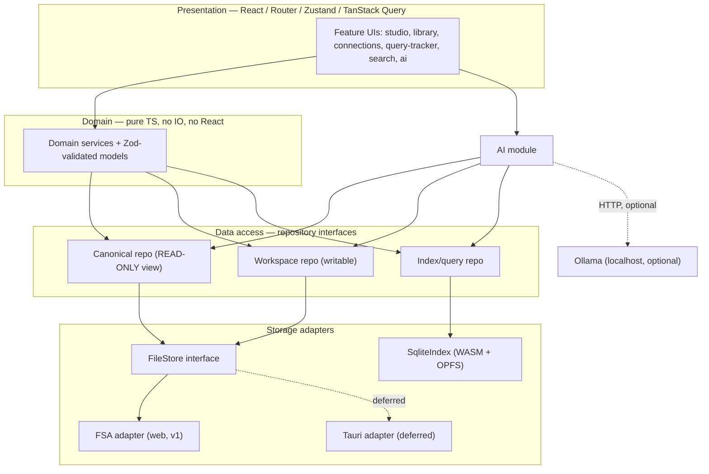
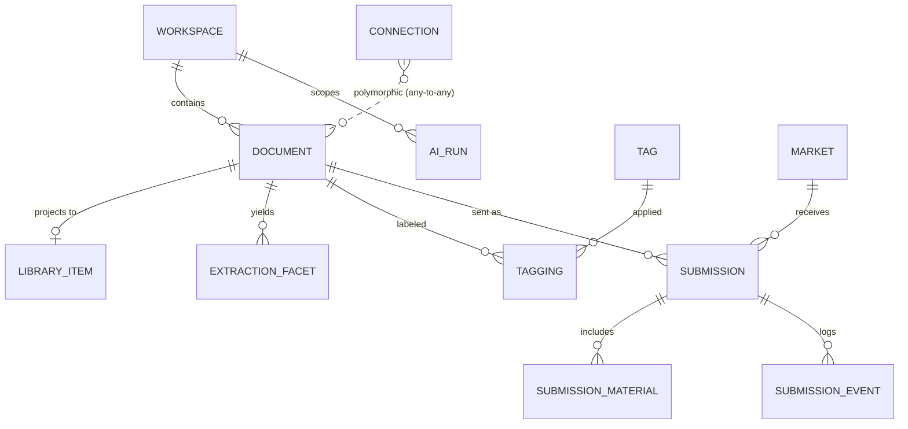
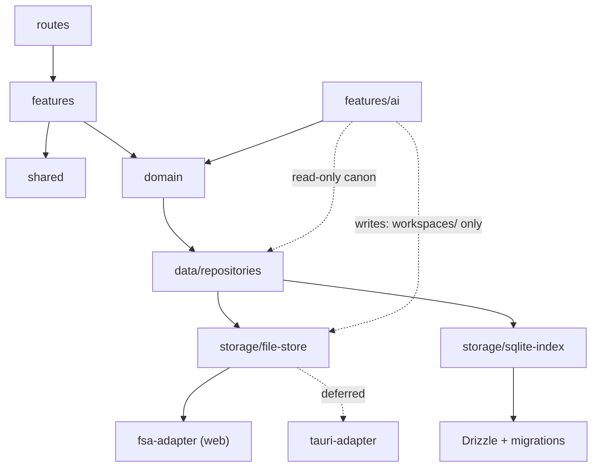

# Creative Archive — Architecture

> Local-first workspace for writers and creative professionals. Organizes creative work as one
> connected graph the writer owns. **AI retrieves; it never authors.**

Design package v1. This is the canonical, in-repo copy of the architecture. It is the document to
redline before each phase.

---

## §0 Foundational decision — partitioned source of truth

Two stores, both first-class, **neither authoritative over the other's data**. Each fact has
exactly one home, chosen by what the data _is_.

| Home                        | Owns                                                                                            | Format                                       |
| --------------------------- | ----------------------------------------------------------------------------------------------- | -------------------------------------------- |
| **Files (the repo)**        | Manuscripts, scenes, notes, story-bible canon, research, library items + extraction             | Markdown + YAML frontmatter, JSON            |
| **SQLite (index & ledger)** | Connections graph, tags, Query Tracker (markets/submissions/events), FTS5 index, future vectors | SQLite; exported to JSON/CSV for portability |

**The linchpin:** every file carries a stable `id` (UUID) in frontmatter. DB rows reference
documents by that UUID, so renaming/moving a file preserves every connection, tag, and submission
link. A file-watcher re-indexes canonical files on change (**files win**, the DB re-derives).
Delete the index → nothing is lost; the app rebuilds it from the folder.

**Why this beats incumbents:** because AI is a retrieval layer over the same canonical files,
**the index _is_ the context** — no re-entering story-bible details already in the manuscript
(the "chicken-and-egg" duplication users hit in Novelcrafter).

---

## §1 Application architecture

Strict layering; dependencies point downward only. The UI never touches storage; the AI module
never touches canonical files except through a read-only capability. The `FileStore` interface is
what makes decision **C** real — the Chromium _File System Access_ adapter ships now; a Tauri
adapter drops in later with no change above it.



### The protected-workspace guarantee (three independent layers)

AI must never modify canon, and the restriction must not rely on prompt instructions. Enforced in
three layers so one failure never breaches canon:

1. **Filesystem** — the AI subsystem only ever receives a `FileStoreWritable` handle scoped to
   `workspaces/`. It never holds a writable handle to canonical folders.
2. **Repository types** — canon is exposed to AI as a `ReadonlyRepo`; no `write`/`delete` methods
   exist on the type. A canon-write fails to compile.
3. **Database** — a SQLite trigger aborts any `ai_run` whose target workspace is not `writable`.

---

## §2 Folder structure

### Code repository (feature-based)

```
creative-archive/
├─ src/
│  ├─ app/                  # bootstrap, providers, router config, theme
│  ├─ routes/               # React Router route modules (thin)
│  ├─ features/             # each feature owns its UI + local state + hooks
│  │  ├─ projects/  studio/  library/  extraction/
│  │  ├─ connections/  query-tracker/  search/  ai/
│  ├─ domain/               # PURE: models (+ Zod) and services; no React, no IO
│  │  ├─ models/  services/
│  ├─ data/
│  │  ├─ repositories/      # interfaces + implementations
│  │  ├─ storage/
│  │  │  ├─ file-store/     # FileStore iface + frontmatter + watcher
│  │  │  │  ├─ fsa-adapter/     # File System Access API (ships v1)
│  │  │  │  └─ tauri-adapter/   # deferred — same interface
│  │  │  └─ sqlite-index/   # Drizzle schema, migrations, FTS, reconciler
│  │  └─ migrations/
│  ├─ shared/               # ui-kit, hooks, utils, result/error types
│  └─ types/
├─ tests/                   # unit (Vitest) · e2e (Playwright)
└─ src-tauri/               # scaffolded but dormant until the Tauri phase
```

### Archive repository (the user's data on disk)

```
My Archive/                  # a git repo, opened via showDirectoryPicker()
├─ .creative-archive/        # manifest.json, config.json (index lives in OPFS, not here)
├─ projects/                 ← PROTECTED (canon, AI read-only)
│  └─ the-glass-house/{manuscript,scenes,notes,world-rules}/  timeline.json
├─ story-bible/              ← PROTECTED (canon): characters/  locations/
├─ library/                  # one file per logged work: books/dune.md, films/…
├─ research/
├─ workspaces/               ← WRITABLE (only place AI may create): scratchpad/ brainstorming/ experiments/
└─ attachments/
```

In the web build the derived SQLite index lives in the browser's **OPFS** (private, rebuildable),
not in the archive folder — so git never sees a binary blob.

---

## §3 Domain model

| Entity              | Home | Notes                                                                                                                                          |
| ------------------- | ---- | ---------------------------------------------------------------------------------------------------------------------------------------------- |
| **Workspace**       | db   | Directory with `protection` ∈ `canonical` \| `writable`. Powers the three-layer guarantee.                                                     |
| **Document**        | file | Generic authored unit; `kind` ∈ manuscript, scene, note, character, location, world-rule, research, library-item, extraction. Indexed by UUID. |
| **Project**         | file | Folder grouping manuscripts, scenes, notes, world-rules, timeline, revisions (= git history).                                                  |
| **LibraryItem**     | file | Logged work (book/film/game/paper/music/experience/dream/observation). DB projection holds `media_type, creator, year, rating`.                |
| **ExtractionFacet** | db   | Queryable slice: review, technique, theme, atmosphere, imagery, dialogue, structure, worldbuilding.                                            |
| **Connection**      | db   | Polymorphic edge (source_type,id) → (target_type,id) + relationship + note. The product's spine.                                               |
| **Tag / Tagging**   | db   | Cross-cutting labels applied polymorphically.                                                                                                  |
| **Market**          | db   | Submission target; `kind` ∈ agent, publisher, magazine, contest.                                                                               |
| **Submission**      | db   | Links a market to a manuscript document + revision ref; status state machine, materials, events.                                               |
| **AiRun**           | db   | Record of an AI task, workspace-scoped, trigger-guarded to writable-only.                                                                      |

---

## §4 Entity-relationship diagram



Solid relationships are FK-enforced. `CONNECTION` is polymorphic — integrity is enforced in the
domain layer and the reconciler prunes dangling edges when a file disappears.

---

## §5 Database schema (index & ledger)

SQLite via Drizzle. The `documents` / `library_items` / `extraction_facets` / `*_fts` tables are
**derived and rebuildable** from files; `connections`, `tags`, and the query-tracker tables are
**canonical here**. Full DDL sketch lives in `docs/schema.sql` (added in Phase 2). Highlights:

- `PRAGMA journal_mode = WAL; PRAGMA foreign_keys = ON;`
- `workspaces(protection CHECK IN ('canonical','writable'))` — registry for the guarantee.
- `documents(id PK = frontmatter UUID, kind, rel_path UNIQUE, content_hash, …)` — the index.
- `connections` — polymorphic, no FK; unique on `(source, target, relationship)`.
- `submissions(status CHECK IN (…), manuscript_rev, …)` — the state machine.
- `TRIGGER ai_runs_writable_only` — aborts AI writes to non-writable workspaces.
- `documents_fts` — contentless FTS5, re-derived from files.
- Future: `doc_vectors` via sqlite-vec (Phase 11+).

---

## §6 Dependency graph



No upward edges, no cross-feature edges (features share only through `domain` and `shared`).

---

## §7 Milestone roadmap

| Phase | Deliverable          | Done when                                                                                                                                      |
| ----- | -------------------- | ---------------------------------------------------------------------------------------------------------------------------------------------- |
| 1     | Project init         | Vite + React + strict TS + pnpm; ESLint/Prettier; Vitest + Playwright green on a smoke test; `src-tauri` dormant.                              |
| 2     | Database schema      | Drizzle schema + migrations; WAL + FKs; runs against WASM SQLite in OPFS; FTS5 created.                                                        |
| 3     | Repository + storage | `FileStore` iface + FSA adapter; frontmatter r/w; **file↔index reconciler** + watcher; rebuild-from-folder passes. _Keystone._                 |
| 4     | Core domain models   | Zod-validated entities + services; pure, fully unit-tested, zero IO imports.                                                                   |
| 5     | UI framework         | App shell, router, Zustand, TanStack Query, ui-kit; "open a folder" flow works end-to-end.                                                     |
| 6     | Studio               | Projects, story bible, notebook (TipTap→MD), timeline, characters, locations; protected-canon boundary live.                                   |
| 7     | Library              | Ten media types logged as files; typed listing via `library_items`.                                                                            |
| 8     | Creative extraction  | Per-item facets as file sections + queryable `extraction_facets`.                                                                              |
| 9     | Connections          | Polymorphic graph create/browse; dangling-edge pruning; graph view.                                                                            |
| 10    | Search               | FTS5 full-text; ranking; incremental re-index.                                                                                                 |
| 11    | Local AI             | Ollama client (optional, degrades cleanly); retrieve/summarize/compare/consistency; output to writable workspaces only; sqlite-vec groundwork. |
| 12    | Query tracker        | Markets + submission state machine + materials + events; manuscript-version linkage; CSV/JSON export.                                          |

Community/collaboration and CRDT sync are **out of scope for v1**. AI (Phase 11) is late and
optional on purpose — Phases 1–10 work with the network unplugged and Ollama uninstalled.
